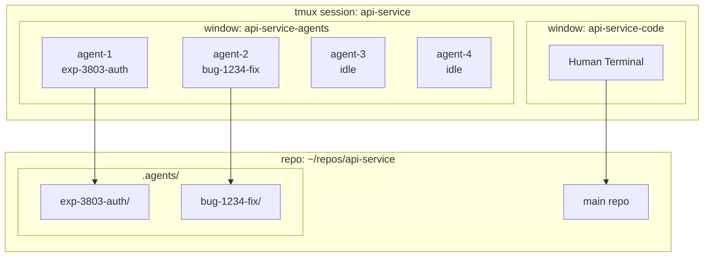
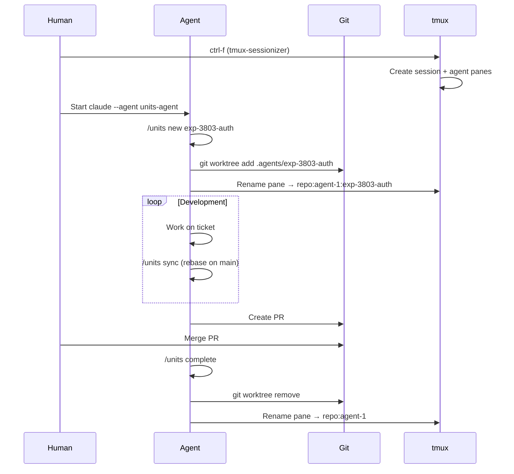
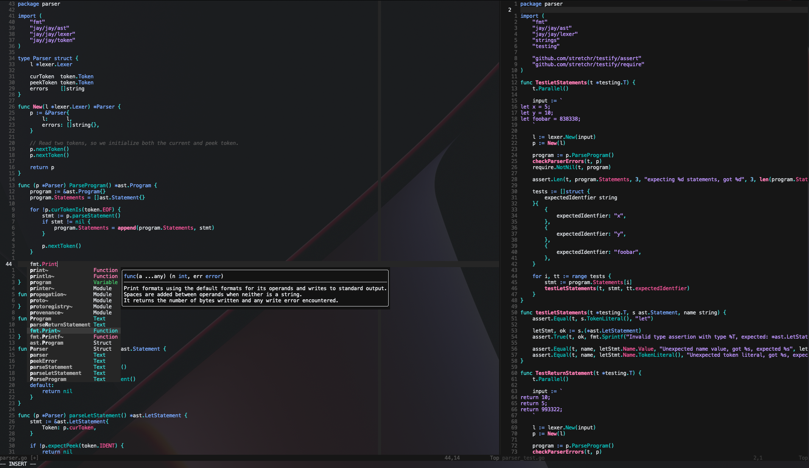
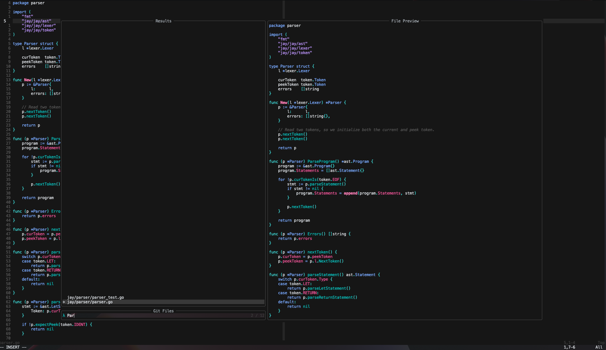
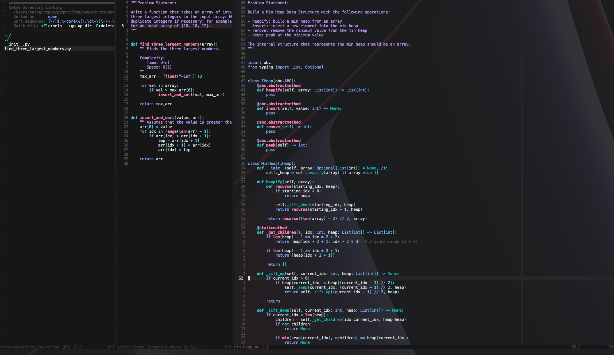

# @sashajdn dotfiles

Personal dotfiles with multi-user support (human + agent profiles).

## Structure

```
dotf/
├── bin/local/bin/     # Custom scripts (unit-*, tmux-*)
├── claude/
│   ├── agents/        # Claude Code agents (symlinked to ~/.claude/agents)
│   └── commands/      # Claude Code skills (symlinked to ~/.claude/commands)
├── config/            # App configs (ghostty, etc.)
├── install/
│   ├── human/         # Human install scripts
│   └── agent/         # Agent install scripts
├── nvim/              # Neovim configuration
├── tmux/              # Tmux configuration
└── zsh/               # Zsh configuration
```

## Install

```bash
# Clone
git clone git@github.com:sashajdn/dotf.git ~/dotf

# Human setup (interactive use)
make install-macos

# Agent setup (CI/automated environments)
make install-macos-agent
```

---

## Multi-Agent Workflow

Run multiple Claude Code agents in parallel on the same repo using git worktrees.

### Architecture



### Workflow



### Quick Reference

| Action | Command |
|--------|---------|
| Open repo session | `ctrl-f` → select repo |
| Start agent | `claude --agent units-agent` |
| Create worktree | `/units new <ticket>` |
| List worktrees | `/units list` |
| Attach to worktree | `/units attach <ticket>` |
| Sync with main | `/units sync` |
| Cleanup worktree | `/units complete` |
| Find pane (fzf) | `<C-a> + f` |
| Split into N agents | `<C-a> + a` → enter N |

### Pane Naming

Format: `{repo}:{agent-N}:{ticket}` (lowercase, only `:` and `-`)

```
api-service:agent-1                    # idle
api-service:agent-1:exp-3803-auth      # working on ticket
api-service:agent-2:bug-1234-fix       # working on ticket
```

### Directory Layout

```
~/repos/api-service/
├── .git/
├── src/
└── .agents/                           # DOTF_AGENTS_WORKTREE_DIR
    ├── exp-3803-auth/                 # worktree for ticket
    │   ├── .git                       # file pointing to main .git
    │   └── src/
    └── bug-1234-fix/                  # another worktree
```

### Configuration

| Variable | Default | Description |
|----------|---------|-------------|
| `MAX_AGENTS` | `4` | Max agent panes per repo |
| `DOTF_AGENTS_WORKTREE_DIR` | `.agents` | Worktree directory name |

Add to global gitignore:
```bash
echo ".agents" >> ~/.gitignore
git config --global core.excludesFile ~/.gitignore
```

### tmux Keybindings

| Key | Action |
|-----|--------|
| `<C-a> + f` | fzf pane finder (across all sessions) |
| `<C-a> + a` | Split window into N agent panes |
| `<C-a> + h/j/k/l` | Navigate panes |
| `<C-a> + o` | Switch to last session |

### Pane Colors (Oxocarbon)

Each agent pane has a distinct border color:
- Agent 1: Pink (`#ff7eb6`)
- Agent 2: Cyan (`#3ddbd9`)
- Agent 3: Green (`#42be65`)
- Agent 4: Purple (`#be95ff`)

---

## Visuals




