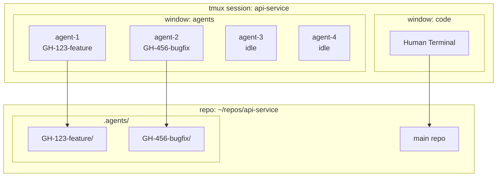

# @sashajdn dotfiles

Personal dotfiles with multi-user support (human + agent profiles).

## Structure

```
dotf/
├── bin/local/bin/       # Custom scripts & binaries
├── claude/
│   ├── agents/          # Claude Code agents (→ ~/.claude/agents)
│   └── commands/        # Claude Code skills (→ ~/.claude/commands)
├── config/              # App configs (ghostty, git, etc.)
├── install/
│   ├── human/           # Human install scripts
│   └── agent/           # Agent/CI install scripts
├── nvim/                # Neovim configuration
├── tmux/                # Tmux configuration
└── zsh/                 # Zsh configuration
```

## Install

```bash
git clone git@github.com:sashajdn/dotf.git ~/dotf

# Human setup (full interactive environment)
make install-macos

# Agent setup (minimal, for CI/automated environments)
make install-macos-agent
```

---

## Neovim

Uses [lazy.nvim](https://github.com/folke/lazy.nvim) for plugin management with the [Oxocarbon](https://github.com/sashajdn/oxocarbon.nvim) colorscheme.

### Structure

```
nvim/
├── init.lua              # Entry point
└── lua/sasha/
    ├── core/             # Core settings (options, keymaps)
    ├── lazy.lua          # Lazy.nvim bootstrap
    └── plugins/          # Plugin specs (one file per plugin)
        ├── lsp/          # LSP configurations
        ├── colorscheme.lua
        ├── telescope.lua
        ├── treesitter.lua
        └── ...
```

### Adding a Plugin

1. Create a new file in `nvim/lua/sasha/plugins/`:

```lua
-- nvim/lua/sasha/plugins/myplugin.lua
return {
    "author/plugin-name",
    event = "VeryLazy",  -- lazy load
    config = function()
        require("plugin-name").setup({
            -- options
        })
    end,
}
```

2. Restart nvim or run `:Lazy sync`

### Key Plugins

| Plugin | Purpose |
|--------|---------|
| `telescope.nvim` | Fuzzy finder |
| `nvim-treesitter` | Syntax highlighting |
| `nvim-lspconfig` | LSP support |
| `nvim-cmp` | Autocompletion |
| `harpoon` | Quick file navigation |
| `nvim-tree` | File explorer |

---

## Tmux

Prefix: `<C-a>`

### Keybindings

| Key | Action |
|-----|--------|
| `<C-a> + \|` | Vertical split |
| `<C-a> + -` | Horizontal split |
| `<C-a> + h/j/k/l` | Navigate panes |
| `<C-a> + H/J/K/L` | Resize panes |
| `<C-a> + n/p` | Next/previous window |
| `<C-a> + o` | Switch to last session |
| `<C-a> + f` | fzf pane finder |
| `<C-a> + a` | Split into N agent panes |
| `<C-a> + r` | Reload config |
| `ctrl-f` | tmux-sessionizer (from shell) |

### Pane Colors (Oxocarbon)

| Pane | Color |
|------|-------|
| Agent 1 | Pink `#ff7eb6` |
| Agent 2 | Cyan `#3ddbd9` |
| Agent 3 | Green `#42be65` |
| Agent 4 | Purple `#be95ff` |

---

## Zsh

### Key Files

| File | Purpose |
|------|---------|
| `zshrc` | Main config |
| `zshfuncs` | Custom functions |
| `aliasrc` | Aliases |
| `zshenv` | Environment variables |

### Notable Keybindings

| Key | Action |
|-----|--------|
| `ctrl-f` | tmux-sessionizer |
| `ctrl-g` | Git branch checkout (fzf) |
| `ctrl-r` | History search (fzf) |
| `ctrl-o` | lf file manager |

---

## Git Worktree Units

Parallel agent workflow using git worktrees. Each ticket gets its own isolated worktree.

### Commands

| Alias | Command | Action |
|-------|---------|--------|
| `un <ticket>` | `unit-new` | Create worktree + cd into it |
| `uc` | `unit-cd` | fzf picker → cd into worktree |
| `ur` | `unit-rm` | fzf picker → remove worktree |
| `ul` | `unit-list` | List all worktrees |
| `us` | `unit-sync` | Sync worktree with main branch |

### Workflow

```bash
# Create new worktree for a ticket
un GH-123-add-feature
# → Creates .agents/GH-123-add-feature/
# → Auto-cds into it

# Switch between worktrees
uc
# → fzf picker shows all worktrees

# Sync with main
us

# Remove worktree when done
ur
# → Warns if uncommitted/unpushed changes
# → Prompts to delete branch
```

### Architecture



### Directory Layout

```
~/repos/api-service/
├── .git/
├── src/
└── .agents/                    # DOTF_AGENTS_WORKTREE_DIR
    ├── GH-123-feature/         # worktree
    │   ├── .git                # points to main .git
    │   └── src/
    └── GH-456-bugfix/          # another worktree
```

### Configuration

| Variable | Default | Description |
|----------|---------|-------------|
| `MAX_AGENTS` | `4` | Max agent panes per repo |
| `DOTF_AGENTS_WORKTREE_DIR` | `.agents` | Worktree directory name |

Add to global gitignore:
```bash
echo ".agents" >> ~/.gitignore
git config --global core.excludesFile ~/.gitignore
```

### Pane Naming

Format: `{repo}:{agent-N}:{ticket}`

```
api-service:agent-1                 # idle
api-service:agent-1:gh-123-feature  # working
```

---

## Claude Code

### Agents

Custom agents in `claude/agents/` (symlinked to `~/.claude/agents`).

```bash
# Start claude with a specific agent
claude --agent units-agent

# Alias
acu  # claude --agent units-agent
```

### Skills

Custom skills in `claude/commands/` (symlinked to `~/.claude/commands`).

---

## Visuals


